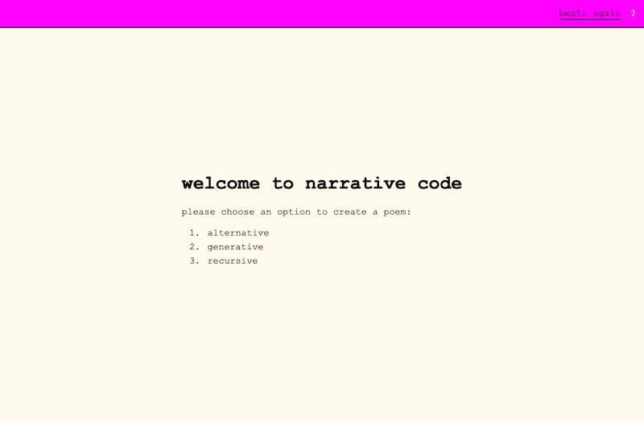
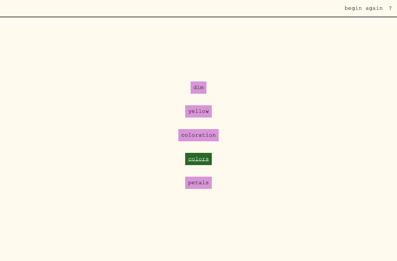
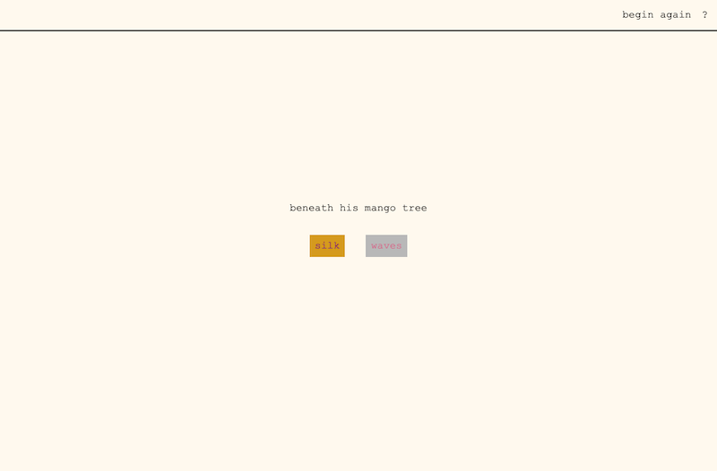
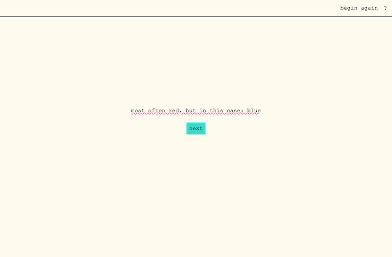
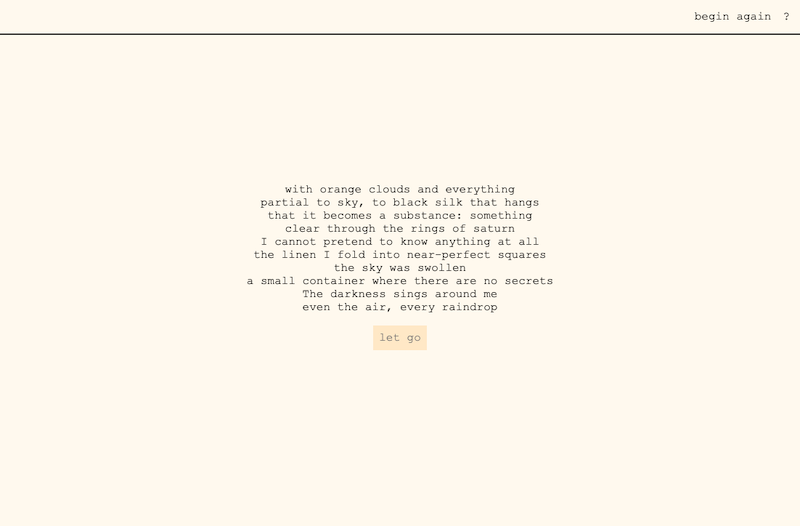

# Narrative Code Project

# Description
I came up with this idea because I wanted opportunities to practice writing functions that used various array methods to 'create' something for the user. Since I'm a writer and an artist, the idea of using JavaScript and CSS to create an aesthetic/narrative experience for the user really interested me. What I also enjoyed was the fact that I'd never built anything like this before, so it forced me to do a lot of reading, research, and creative problem-solving!

The 'lines' of each poem (there are four in use for this project) are written by me, but pulled, individually, based on user-input, to build a completely differet poem.

Functions, intially, were all different so I could practice different array methods, but were later refactored into two functions that were used as needed with different data passed in. 

# Technologies
- Vanilla Javascript, CSS, HTML
- [Datamuse API](https://www.datamuse.com/api/)

# Challenges & Solutions

- Challenge: When a line of a poem is printed to the DOM, two buttons come along with it. Those buttons create the NEXT line of the poem. But! I quickly realized I couldn't add a click function to a DOM element that didn't exist yet.
    - Solution: I tried if(element), but once the program ran, it didn't run again to re-check if the element existed later. I considered writing one parent function that contained all of the consecutive functions, but it grew exponentially, and this seemed like a bad and hard-to-manage solution. I looked into using Mutation Observers, but the syntax was too bulky and complex for such a (seemingly!) simple program. 
        - Finally, I came up with a way to pass down the necessary variables and click handlers from one function to another. When a new line of the poem is generated, the buttons that follow recieve their own data (like name and id) and also the array, user choice, and click function they will run. 
        - When the user clicks one of the buttons, the function that is called not only generates a new line of the poem, but also the additional pair of buttons, again, with necessary data passed in. 
        - The naming (with ids/classes) may seem excessive, but as each will be paired with its own CSS animation/function, I needed to be fairly specific! I did figure out ways to cut down on naming as I progressed, though there's still a lot!

- Challenge: Initial functions were bulky!
    - Solution: I figured out ways to make them more dynamic and re-usable; utilzing the 'choice' generated with each click to search the corresponding array for the line to be printed to the DOM. I was also able to create a singular function for creating two buttons as once, cutting down on the code within each poem function.

    Eventually, I opted to refactor all functions into two: either a choice-based narration function, or a random number-based narration function. This cleaned things up considerably!

- Challenge: I wanted to practice recursion!
    - Solution: I made a third poem option, a recursive poem generator.

# Goals
- To improve my understanding and skill using various array methods and functions
- A choice-based narrative experience for the user where they 'create' a poem
- Use of simple CSS animations to make the experience more visually stimulating

# Stretch Goals (WIP)
- To implement more CSS transitions/animations. 
- Make the main poem generating function (ie the 'alternative' poem) recursive.
- Option to save (email via form) poem and/or 'scramble' the poem upon finishing.

# I am working on the stretch goals currently, and my guess is I'll chip away at them slowly, when I have bits of free time! #
 
 

